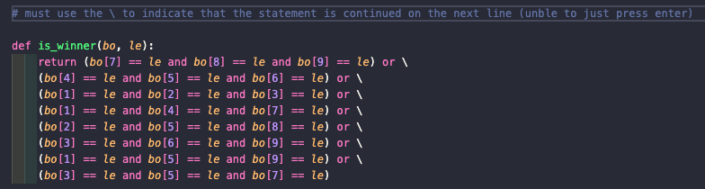

# Tic Tac Toe With Tim

Hello and happy Sunday evening, August 06, 2023. It's just after 8:00 p.m. and I'm settling in to follow along with **Tim Ruscica** of [**Tech With Tim**][def] as he creates a AI powered tic tac toe game in Python. I've just completed a 22-hour boot camp-style introductory course to the Python language, so I'm kind of excited to learn more through creating things. Tim seems like he's a great teacher, so I can't wait to dig in.

As I go along on this journey to gaining my TensorFlow certification in 357 days, I'll be doing these coding journals in each of the GitHub repos that I open. Some of the READMEs will contain multiple entries. These are more for me than for you, but if you are me reading this 357 days from now, good luck on that TensorFlow exam!

A note regarding the first video [Tic Tac Toe video 1][def2]:

This is the playlist I am listening to on Apple Music lately while I learn. It's very conducive to learning as the title suggests would be the case.

[def]: https://www.techwithtim.net/
[def2]: https://www.youtube.com/watch?v=5s_lGC2sxwQ
